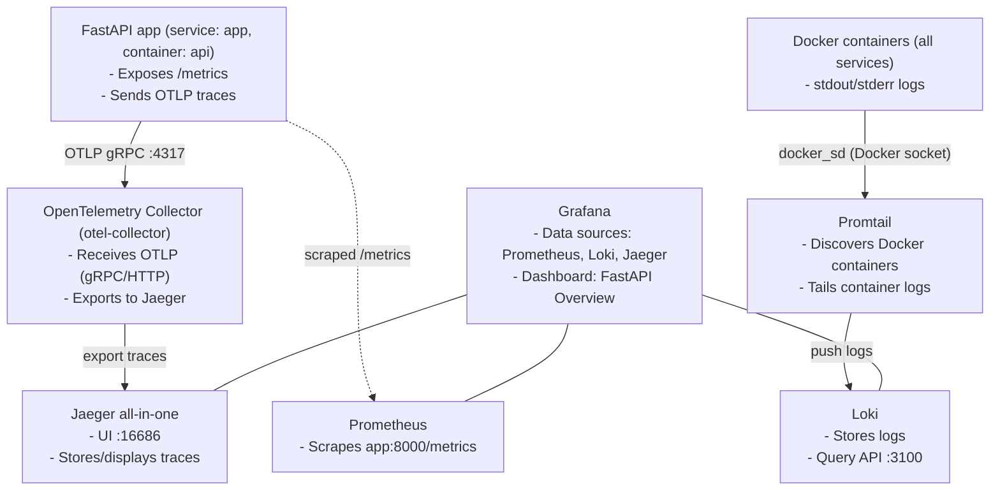

## Monitoring and Observability Architecture

This document describes the monitoring, logging, and tracing setup defined in `server/docker-compose.yml` and related configs under `server/`.

### Stack overview

- **FastAPI app (`app`)**: Exposes Prometheus metrics and emits OpenTelemetry traces.
- **OpenTelemetry Collector (`otel-collector`)**: Receives OTLP traces and exports to Jaeger.
- **Jaeger (`jaeger`)**: Trace storage and UI.
- **Prometheus (`prometheus`)**: Scrapes app metrics.
- **Loki (`loki`)**: Log storage and query API.
- **Promtail (`promtail`)**: Tails Docker logs and pushes to Loki.
- **Grafana (`grafana`)**: Dashboards with datasources for Prometheus, Loki, and Jaeger.

### Service configuration and responsibilities

- **FastAPI app (`app`)**
  - Metrics: `prometheus_fastapi_instrumentator` exposes `/metrics`.
  - Tracing: OpenTelemetry SDK with `OTLPSpanExporter()`; provider/resource set in code.
  - Health: `/health`, `/healthz` (used by container healthcheck).
  - Key files: `server/app/main.py`, `server/docker-compose.yml`.
  - Relevant env in compose:
    - `OTEL_SERVICE_NAME=fastapi-backend`
    - `OTEL_EXPORTER_OTLP_ENDPOINT=otel-collector:4317`
    - `OTEL_TRACES_EXPORTER=otlp`
    - `OTEL_METRICS_EXPORTER=none`
    - `OTEL_LOGS_EXPORTER=none`

- **OpenTelemetry Collector (`otel-collector`)**
  - Config: `server/otel-collector-config.yaml`.
  - Receivers: `otlp` (gRPC and HTTP).
  - Processors: `batch`.
  - Exporters: `otlp` (to `jaeger:4317`, `tls.insecure: true`), `logging`.
  - Pipelines: `traces` only (no metrics/logs).

- **Jaeger (`jaeger`)**
  - Image: `jaegertracing/all-in-one` with `COLLECTOR_OTLP_ENABLED=true`.
  - Ports: `16686` (UI), `14250`, `14268`, `6831/udp`.

- **Prometheus (`prometheus`)**
  - Config: `server/prometheus.yml`.
  - Scrapes: `app:8000/metrics` (job `fastapi`, `scrape_interval: 15s`).

- **Loki (`loki`)**
  - Config: `server/loki-config.yml`.
  - Storage: single-node filesystem via `boltdb-shipper`, WAL enabled.
  - Ruler API enabled for alert rule storage in `/loki/rules`.

- **Promtail (`promtail`)**
  - Config: `server/promtail-config.yml`.
  - Discovery: Docker via `/var/run/docker.sock` (`docker_sd_configs`).
  - Labels: adds `job=docker`, `container`, `service` (from compose).
  - Push: `http://loki:3100/loki/api/v1/push` (tenant `docker`).
  - Note: `app` has compose label `logging=promtail` (useful for filtering; current promtail config does not restrict by this label).

- **Grafana (`grafana`)**
  - Provisioned datasources: `Prometheus` (`http://prometheus:9090`), `Loki` (`http://loki:3100`), `Jaeger` (`http://jaeger:16686`). See `server/grafana/provisioning/datasources/datasources.yml`.
  - Provisioned dashboards folder: `server/grafana/provisioning/dashboards/` with provider config `dashboards.yml`.
  - Example dashboard: `fastapi-overview.json` (panels for uptime, RPS, p95 latency, 5xx rate).
  - Auth: anonymous enabled with `Admin` role; login form disabled (development-friendly, insecure for prod).

### Connectivity and data flow

- **Traces**
  - App exports OTLP gRPC to `otel-collector:4317` (configured by env).
  - Collector receives, batches, and exports to Jaeger (`jaeger:4317`).
  - Grafana queries Jaeger for traces.

- **Metrics**
  - Prometheus scrapes `app:8000/metrics` (`metrics_path: /metrics`).
  - Grafana queries Prometheus.

- **Logs**
  - Promtail discovers all Docker containers, tails stdout/stderr.
  - Relabels add `job`, `container`, `service` labels.
  - Logs pushed to Loki; Grafana queries Loki for logs.

### Diagram

### Prometheus queries used (examples)

- **Uptime**: `time() - process_start_time_seconds{job="fastapi"}`
- **RPS**: `sum by (method, path) (rate(http_requests_total{job="fastapi"}[1m]))`
- **p95 latency**: `histogram_quantile(0.95, sum by (le, method, path) (rate(http_request_duration_seconds_bucket{job="fastapi"}[5m])))`
- **5xx error rate**: `sum by (method, path) (rate(http_requests_total{status=~"5..",job="fastapi"}[1m]))`

#### LLM metrics (custom)

The LLM service layer exposes additional Prometheus metrics:

- `llm_calls_total{model,provider,endpoint}`
- `llm_latency_seconds_bucket{model,provider,endpoint}` (with `_sum` and `_count`)
- `llm_tokens_total{model,provider,type}` where `type` is `prompt` or `completion`
- `llm_errors_total{model,provider,reason}`

Example queries/panels:

- Calls per minute by model: `sum by (model) (rate(llm_calls_total[1m]))`
- p95 LLM latency: `histogram_quantile(0.95, sum by (le, model, endpoint) (rate(llm_latency_seconds_bucket[5m])))`
- Prompt vs completion tokens per model: `sum by (model, type) (rate(llm_tokens_total[5m]))`
- Error rate by reason: `sum by (reason) (rate(llm_errors_total[5m]))`

### Ports and access

- **App**: `:8000` (API, `/metrics`, `/healthz`)
- **Prometheus**: `:9090` (UI)
- **Grafana**: `:3030` (UI)
- **Jaeger**: `:16686` (UI)
- **Loki**: `:3100` (API)
- **OTLP**: `otel-collector:4317` (Collector gRPC)

### Security and operational notes

- Grafana anonymous Admin is convenient for dev; disable for prod.
- Promtail mounts the Docker socket; restrict privileges in prod.
- Loki data persisted via `loki-data` volume; Prometheus has no persistent volume (ok for dev).
- OTEL metrics/logs exporters disabled via env; only traces enabled.
- Healthcheck uses `/healthz`; metrics are at `/metrics`.

### Potential improvements

- Add log relabeling for environment/version (e.g., propagate compose labels like `environment`, `service.version`).
- If desired, switch or mirror traces to Grafana Tempo; current Jaeger setup is fine and supported.
- Add alerting:
  - Prometheus alert rules and Alertmanager are not configured.
  - Loki ruler is enabled; add log alert rules in `/loki/rules`.
- Enhance OpenTelemetry Collector:
  - Add `resource` processor to enrich spans (e.g., `service.version`, `deployment.environment`).
  - Expose and scrape Collector metrics (if enabled) via Prometheus.
- Consider exemplars: correlate Prometheus metrics with trace IDs for Grafana linking.
- Restrict Promtail to containers with label `logging=promtail` if you want selective log ingestion.
- Set Loki retention and limits (`limits_config`) for production.
- Secure Grafana (disable anonymous, set admin credentials) when moving beyond local dev.

